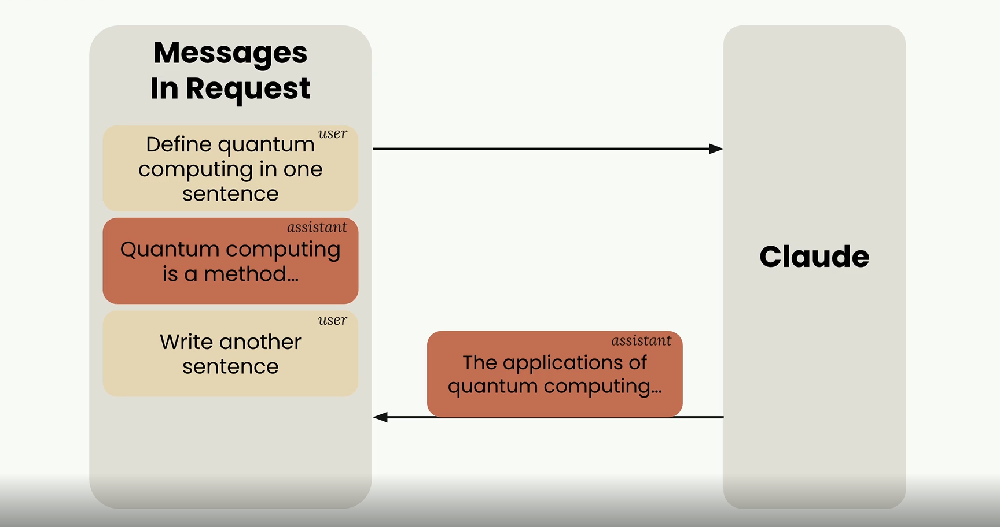
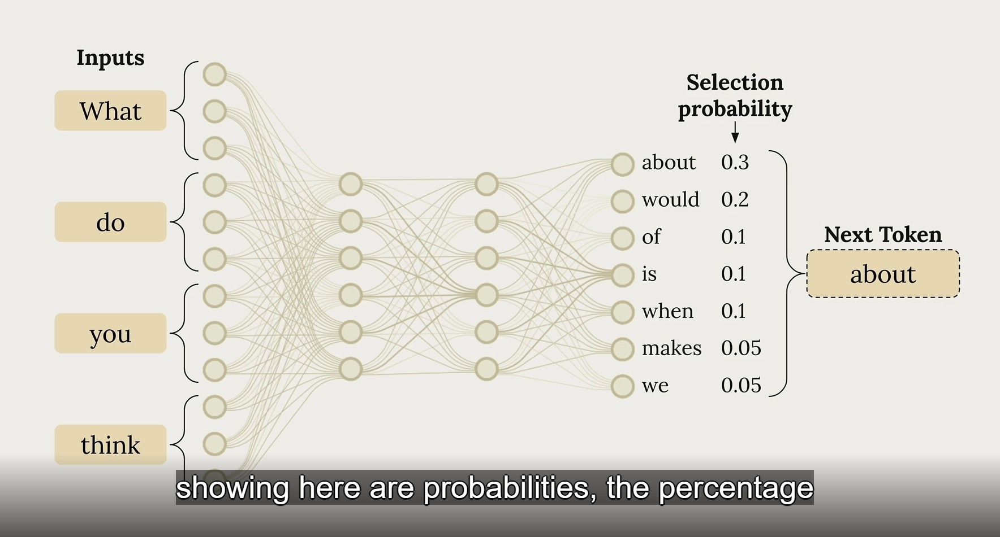
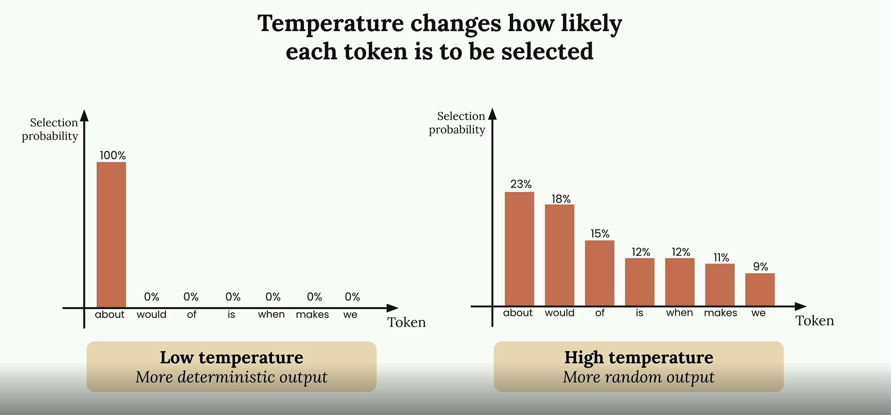
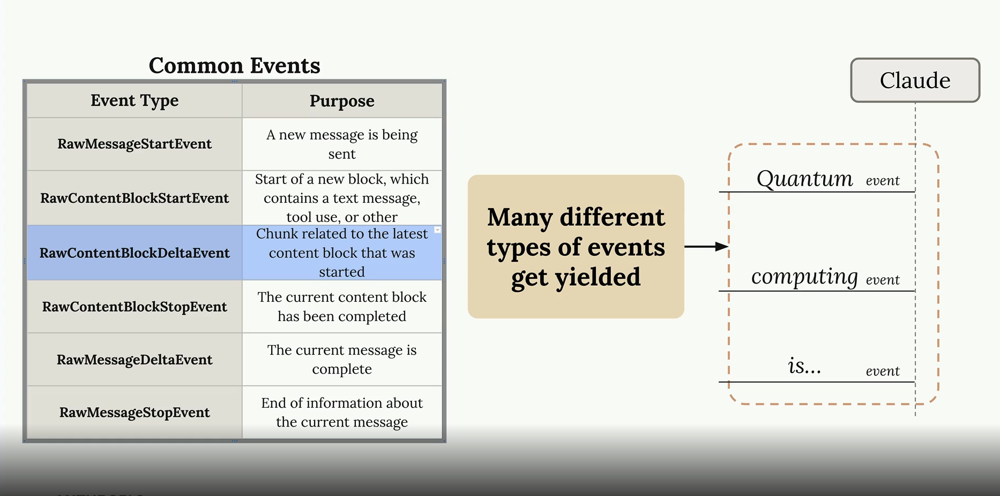
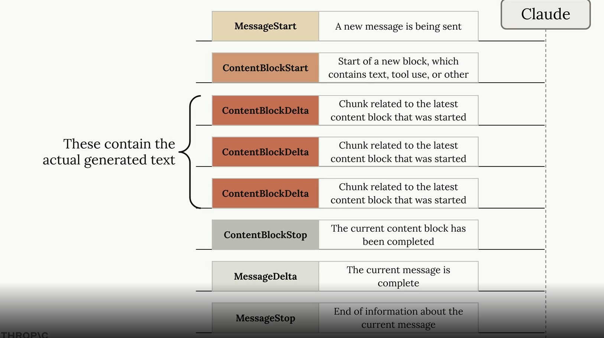
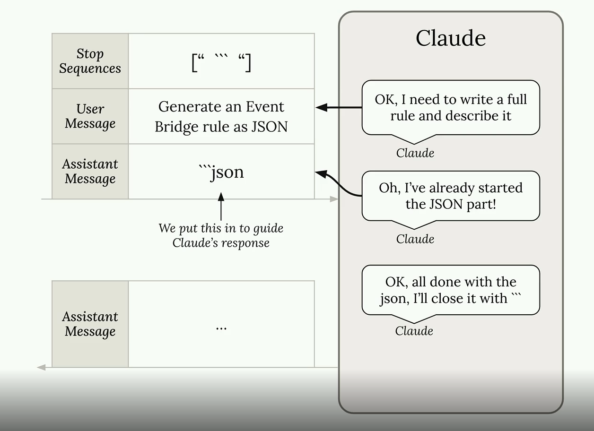
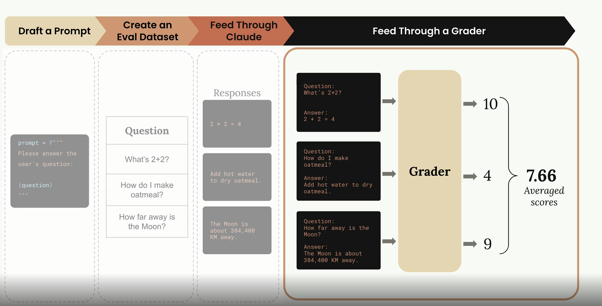

## Steps to Create an API Key in Anthropic

1. Go to Anthropic API console: `console.anthropic.com`
2. Click on **Get the API Key** button in the API console dashboard
3. Click on **Create API Key**
4. Select or create a **Workspace** — workspace is basically a segmentation provided by Anthropic for our API keys. With the help of workspace we can categorize the API keys and define different attributes for the workspace which help us control the access of the API key. Attributes include:
   - **Spending Limit:** We can set a monthly spend cap for all keys in a workspace collectively
   - **Model Access:** Define which models can be accessed by the workspace
   - **Team Member Access:** Define which user/member can access the workspace
   - **Token Tracking:** Workspace can also be used to track token consumption
5. Add the name for the API key
6. Click on **Add**
7. Copy the key and use it

---

## Getting Started with Usage of API Key

Basically we access/interact with Claude in Anthropic SDK with the `create` function which takes 3 arguments:

- **model:** Define karta hai konsa model use karna hai for generation of result
- **max_tokens:** Define karega hamare answer meh maximum kitne tokens hone chahiye (1 token = 4 characters usually, size can vary)
- **messages:** Basically yeh list of messages hoti hai jo hum model ko pass karte hai. Is list meh basically hum dictionary pass karte hai jisme 2 keys hoti hai:
  1. `"role"`: Iske andar 2 values pass ho sakti hai:
     - `user` — yeh define karta hai message user ke taraf se aaya hai
     - `assistant` — yeh define karta hai message AI ne diya hai
  2. `"content"`: Yeh jo content either user ne diya hai ya assistant ne vo aayega in string format

**Example:**

```python
from anthropic import Anthropic

client = Anthropic()
model = "claude-sonnet-4-0"

messages = client.messages.create(
    model=model,  # basically these are all the attributes we gonna pass to the user
    max_tokens=1000,
    messages=[
        {"role": "user", "content": "what is quantum physics"}
    ]
)
```

To access the content: `messages.content[index of message whose content we want to see].text`

---

> **Important:** Anthropic API and Claude does not store any messages which are sent to them — neither the messages with `"role":"user"` nor the messages with `"role":"assistant"` are stored by Claude. So basically if we send some follow-up question or message which is contextual to a previous message, it is not gonna retain any context and will respond with a vague new result.

**Example of the problem:**

```
Q1: explain what is quantum computing in one sentence
A1: "quantum computing is computing done with quantum state of a semiconductor which gives different results in different states"

Q2: "give one sentence more"
A2: "old macdonalds had a farm e-i e-i-o"
```

So basically because Anthropic does not store the responses or messages, it gives out-of-context answers.



### Solution — Maintaining Conversation Context

In order to overcome this issue, we will create a list of all the messages in the chat and store them. We can create three functions to do so:

```python
def add_user_message(messages, text):
    user_message = {
        "role": "user",
        "content": text
    }
    messages.append(user_message)

def chat(messages):
    response = client.messages.create(
        model=model,
        max_tokens=1000,
        messages=messages
    )
    return response.content[0].text

def add_assistant_message(messages, text):
    assistant_message = {
        "role": "assistant",
        "content": text
    }
    messages.append(assistant_message)
```

Now we take a list to store every conversation:

```python
context = []
user_input = input("-->")
add_user_message(context, user_input)
llm_response = chat(context)
add_assistant_message(context, llm_response)
print(llm_response)
```

---

## Customizing Response Tone

In order to customize the tone of Claude to generate answers, we pass a `system` prompt to the `client.messages.create()` function. This attribute takes a string as input where we define how the system will behave when a question is asked, and according to those standards it will provide a response.

**Syntax:**

```python
system_prompt = """description of how claude should behave"""

response = client.messages.create(
    model=model,
    max_tokens=1000,
    messages=message_block,
    system=system_prompt
)
```

---

## Temperature

Basically jab bhi hum koi text (sentence) Claude ko dete hai, Claude is text ko tokenize kar deta hai and then vo calculate karta hai in a probabilistic manner what will be the next text.



Basically Claude har ek predictive text ko ek probability assign kar deta hai. Jis text ki probability sabse zyada hoti hai, Claude use text ko as a next token in the sentence consider kar leta hai — and basically aise answer create hota hai. Temperature ki value 0–1 ke beech meh hoti hai and according to this value hum decide kar sakte hai ke hamne exact most probable value chahiye ya hum segregated values se bhi kaam chala sakte hai.



- **High temperature** → more random / creative answers
- **Low temperature** → more deterministic / precise answers

**Example:**

```python
def chat(messages, system=None, temperature=0.0):
 params = {
     "model": model,
      "max_tokens": 1000,
      "messages": messages,
      "system": system,
      "temperature":temperature
  }
 response = client.messages.create(**params)
    return response
```

---

## Streaming
 • so basically jabh user ek chat app use karta hai toh vo expect karta hai keh usko jaldi seh jaldi response mill sake chahe saara hi naah mille so basically hum iseh chez koh use kar sakte hai apne response koh pura kah pura naah bhejkar in divided chunks bhejkar iseh purpose koh fullfill karne keh liye claude hame response koh rather than a whole message bhejne keh jagha hum logo useh message koh chunks stream keh tarah bhejne keh facilaty bhi deta hai 
 •isme hum ek stream keh andar chunks koh bhejte hai isko use karne keh liye hum yah toh clients.messages.create()function meh stream=True pass kar sakte hai yah hum clients.messages.stream() function bhi use kar sakte hai iseh function meh bhi hame model,max_tokens,messages pass karne padhenge
 •basically jabh hum stream function use karte hai toh hamare pass different events meh data aata hai jisme hum text extract karke user koh message print karate hai 
 •jese
   1.MessageStart(yeh basically flag hai joh batah hai keh claude koh naaya message send hua hai and validate karta hai keh claude keh pass message phochgaya hai )
   2.ContentBlockStart(yeh start of a new block koh define karta hai jisme metadata hota hai tool use etc kah)
   3.ContentBlockDelta(isme message chunks honge jisme text hoga joh user koh display karenge )
   4.ContentBlockStop(yeh event define karega keh current Content Block khatam ho chukka hai)
   5.MessageDelta(yeh basically define karega keh current message is complete)
   6.MessageStop(yeh end information aur metadata share karega current ended message kah)



   e.g  

      with client.messages.stream(
        model=model,
        max_tokens=1000,
        messages=message_block,

      ) as stream 
      for text in stream.text_stream:
        print(text,end="")#basically this will provide us the text in streams as it comes from the ContentBlockDelta event as it is genrated by the llm
    
    print stream.get_final_message()#this will give us all the meta data which is created at the end of the stream
    


## Structuring data 
   • basically jabh hum claude koh koi query karte hai toh c•laude uska result hame with description and sumerisation provide karta hai jese  
    e.g  
```text
 ```json
{
  "source": ["aws.ec2"],
  "detail-type": ["EC2 Instance State-change Notification"],
  "detail": {
    "state": ["running"]
  }
}
This rule captures EC2 instance state changes when instances start running.

```
joh keh basically ek markdown  structure hai isko  .md file apne aap samajh jayegi but it is diffcult for user to use it directly so to overcome this problem hum preassignment of assistant message and stop_sequence use karte hai 
by preassigning the text or literals we need to remove with add_assistant_message(message_block,"text we want to remove from starting the claude output") and chat(message_block,stop_sequence="text wanted to remove from the end of message) basically provide us structuring of data



## prompt evaluation 
  • so basically jabh hum ek production level application create karne jaate hai tabh hame ai koh joh system prompts dene hote hai joh usko batah hai vo kese behave karega jabh user query karega hame uneh validate karna padhta hai keh kya yeh prompt kiseh bhi tarah system koh effect toh nahi kar rahe jiseh hamare user experince par koi negative effect padhe toh isko handle karne keh usually 3 methods hote hai 
   1. test the prompt once and decide its good enough (yeh method ek significant risk carry karta hai of breaking in production jabh user unexpected input enter karta hai )
   2. test the prompt as few times and tweak it to handle a corner case or two(when a user input toh vo kafi unexpected outputs bhi deh sakta hai )
   3.run the prompt through a evaluation pipeline to score it then iterate on the prompt based on objective metrics this approach requires more time but gives confidence for the prompt
  • steps to create a prompt eval pipeline
    1. Initial prompt draft:- iseh step hum log ek inital prompt draft likenge basically ek prompt likenge jisko hum improve karna chahte hai kiseh prespective meh 
    e.g prompt = f"""Please answer the user's question:
        {question}
        """
    2.Create a Evalutaion dataset:- basically isme hum ek dataset create karenge questions kah joh user puch sakta hai ineh question koh hum apne inital prompt draft meh pass karenge for testing it. we can create a dataset by hand or we can ask claude to create these dataset for us 
    3. Feed through prompt:- one by one hum iseh data set keh andar keh question koh prompt meh pass karke claude koh feed karenge and uske repsonse lenge
    4. Feed through the grader:- basically hamare pass joh questions theh joh hamne apne prompt meh pass kare theh aur unke joh anwer aaye theh hum ineh dono koh ek sath club karenge and pass kardenge ek grader grader inko rate karega in terms of out of 10 iseh hamare pass question and unke answer keh grading hojayegi
    ham firh ineh saare grades keh average nikalenge and that will be the score of the prompt 
    5. after this we can do enhancement in out prompt and retest the new prompt again and compare them on the basis of score 
    
